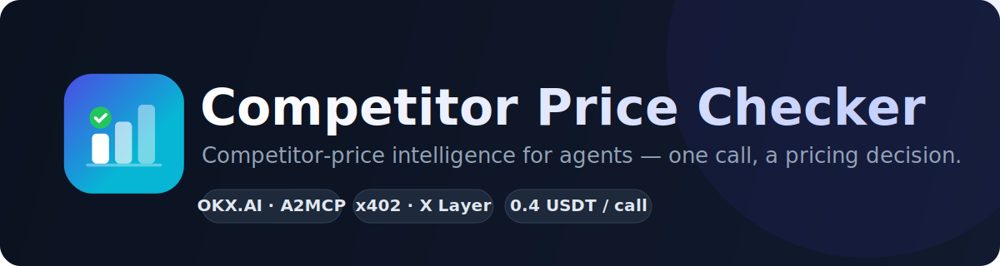
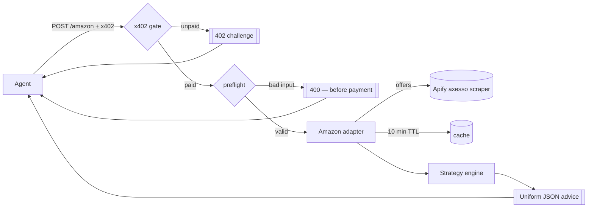

<p align="center">
  
</p>

<p align="center">
  
  
  
  
  
  
  
</p>

> **Competitor-price intelligence for agents.** Give it a product, get back a **pricing decision** —
> not a raw scraper dump. An [OKX.AI](https://www.okx.ai) **A2MCP** Agent Service Provider on X Layer,
> paid per call via **x402**.

---

## Table of contents

- [Why an agent needs this](#why-an-agent-needs-this)
- [What it returns](#what-it-returns)
- [Architecture](#architecture)
- [Endpoints](#endpoints)
- [Example](#example)
- [Pricing strategies](#pricing-strategies)
- [Payment (x402)](#payment-x402)
- [Data source & honesty](#data-source--honesty)
- [Quick start](#quick-start)
- [Configuration](#configuration)
- [Roadmap](#roadmap)
- [Project structure](#project-structure)
- [License](#license)

---

## Why an agent needs this

An agent running a store — repricing inventory, sourcing products, quoting a buyer — constantly hits
the same question it cannot answer alone:

> *"What should I price this at, given what my competitors are charging right now?"*

Competitor Price Checker is the primitive that answers it. One call returns the live competitive
landscape **plus a menu of pricing strategies** the agent can act on — as structured JSON, not a web
page it has to scrape. Every result carries an `evidence` block so the decision rests on data the
agent can reason about, not a black box.

## What it returns

- **Market snapshot** — Buy Box price, lowest / median / highest, offer count, and where *your* price sits.
- **Four strategies, not one number** — `Win`, `Match`, `Premium Hold`, `Margin Floor`, each with a price,
  a rationale, and (if you pass your cost) the resulting margin. The agent picks; we recommend a default.
- **Honest evidence** — data source, how many offers were analyzed, cache status, and an explicit caveat.

## Architecture

One ASP, one domain. Each marketplace is its own **path-based** service behind an x402 gate — the
pattern OKX's [`howtomcp`](https://web3.okx.com/onchainos/dev-docs/okxai/howtomcp) guide describes.
The analysis core is marketplace-agnostic; each marketplace is a thin **adapter** that normalizes to
one uniform output shape.



## Endpoints

| Method | Path              | Auth                | Price      | Purpose                                             |
|--------|-------------------|---------------------|------------|-----------------------------------------------------|
| `POST` | `/amazon`         | x402                | 0.4 USDT   | Competitor-price advice for an Amazon listing (Buy Box). |
| `POST` | `/ebay`           | x402                | 0.4 USDT   | Competitor-price advice for an eBay search (keyword). |
| `POST` | `/walmart`        | x402                | 0.4 USDT   | Competitor-price advice for a Walmart search (keyword). |
| `POST` | `/aliexpress`     | x402                | 0.4 USDT   | Competitor-price advice for an AliExpress search (keyword). |
| `POST` | `/etsy`           | x402                | 0.4 USDT   | Competitor-price advice for an Etsy search (keyword). |
| `POST` | `/preview/{marketplace}` | free (rate-limited) | —   | Same schema, no payment. (`amazon` · `ebay` · `walmart` · `aliexpress` · `etsy`) |
| `GET`  | `/quote`          | free                | —          | Pricing, pay-to address, and x402 status.           |
| `GET`  | `/health`         | free                | —          | Liveness + config echo.                             |

Every marketplace returns the **same** result shape — only the input and the `leaderLabel`
("Buy Box" vs "lowest listing") differ.

**Input** (`application/json`):

`/amazon` — identify the listing by URL or ASIN:

| Field         | Type   | Required | Notes                                                    |
|---------------|--------|----------|----------------------------------------------------------|
| `product_url` | string | one of\* | Amazon listing URL — the ASIN is extracted from it.      |
| `asin`        | string | one of\* | Raw 10-char ASIN, if you already have it.                |
| `my_price`    | number | no       | Your current price — unlocks positioning + recommendation. |
| `my_cost`     | number | no       | Your unit cost — unlocks the `Margin Floor` strategy.    |
| `domain`      | string | no       | Marketplace code (`com`, `co.uk`, `de`, …). Default `com`. |

\* Provide `product_url` **or** `asin`.

`/ebay`, `/walmart`, `/aliexpress` and `/etsy` — no shared listing, competitors found by keyword:

| Field      | Type   | Required | Notes                                              |
|------------|--------|----------|----------------------------------------------------|
| `query`    | string | yes      | Product search keyword. Be specific for a tight match. |
| `my_price` | number | no       | Your current price — also anchors relevance (drops off-band accessory listings). |
| `my_cost`  | number | no       | Your unit cost — unlocks `Margin Floor`.           |

## Example

```bash
curl -s -X POST https://<your-domain>/preview/amazon \
  -H 'Content-Type: application/json' \
  -d '{"product_url":"https://www.amazon.com/dp/B0966NLTZS","my_price":610,"my_cost":450}'
```

```json
{
  "summary": "Buy Box $600.19 by RichMondHS across 8 New offers (range $600.19–$619.99). You are at $610 ($9.81 above the Buy Box — rank 2/9, losing the Buy Box). Recommendation: Win at $600.18.",
  "product": { "id": "B0966NLTZS", "marketplace": "amazon.com", "currency": "$" },
  "market": {
    "offerCount": 8, "totalOffers": 11,
    "lowest": 600.19, "median": 619, "highest": 619.99,
    "leaderPrice": 600.19, "leaderSeller": "RichMondHS", "leaderLabel": "Buy Box",
    "yourPosition": "$9.81 above the Buy Box — rank 2/9, losing the Buy Box"
  },
  "strategies": [
    { "name": "Win",          "price": 600.18, "note": "undercut the cheapest New offer by 0.01 to take the Buy Box", "margin": 150.18 },
    { "name": "Match",        "price": 600.19, "note": "match the Buy Box — stay competitive without a price war",     "margin": 150.19 },
    { "name": "Premium Hold", "price": 619.99, "note": "hold higher and lean on rating / Prime / faster shipping",     "margin": 169.99 },
    { "name": "Margin Floor", "price": 450.00, "note": "your cost — never price below this",                           "margin": 0 }
  ],
  "recommendation": "Win",
  "evidence": {
    "source": "Apify axesso amazon-product-offers-scraper",
    "marketplace": "amazon.com", "analyzedCount": 8, "fromCache": false,
    "caveat": "Buy Box is approximated by the lowest landed New offer. Amazon's real Buy Box also weighs Prime, seller rating, fulfillment and stock — price alone is not decisive."
  }
}
```

## Pricing strategies

Comparison is on **landed price** (`item + shipping`), across **New**-condition offers only.
The *leader* is the price to beat — the **Buy Box** on Amazon, the **lowest listing** on eBay.

| Strategy       | Price                     | When to use                                                       |
|----------------|---------------------------|-------------------------------------------------------------------|
| **Win**        | leader − `UNDERCUT_STEP`  | Take the lead now. Recommended when you're priced above it.        |
| **Match**      | leader                    | Stay competitive without kicking off a price war.                 |
| **Premium Hold** | your price / highest    | Hold a premium and compete on rating, shipping, and returns.      |
| **Margin Floor** | your cost               | Hard floor — shown only if `my_cost` is set. Never sell below it. |

If undercutting would fall below your cost, the engine will **not** recommend `Win`.

## Payment (x402)

Paid endpoints follow the [x402](https://web3.okx.com/onchainos/dev-docs/okxai/howtomcp) protocol,
settled by the OKX facilitator via `@okxweb3/x402-express`.

| | |
|---|---|
| Network   | X Layer — `eip155:196` |
| Asset      | USDT0 — `0x779ded0c9e1022225f8e0630b35a9b54be713736` (6 decimals) |
| Price      | `0.4 USDT` (`amount = 400000`) per paid call |
| Flow       | unpaid → `HTTP 402` + `PAYMENT-REQUIRED` challenge → pay → `HTTP 200` + advice |
| Free tier  | none on paid endpoints — every `/amazon` call is metered |

Deterministic failures (missing / malformed input) are rejected with `400` **before** any charge.

## Data source & honesty

- Offers come from **Apify** ready-made actors — no self-hosted browser, no CAPTCHA wrangling:
  Amazon via [`axesso_data/amazon-product-offers-scraper`](https://apify.com/axesso_data/amazon-product-offers-scraper),
  eBay via [`automation-lab/ebay-scraper`](https://apify.com/automation-lab/ebay-scraper),
  Walmart via [`pear_fight/walmart-scraper`](https://apify.com/pear_fight/walmart-scraper),
  AliExpress via [`kawsar/aliexpress-search-scraper`](https://apify.com/kawsar/aliexpress-search-scraper),
  Etsy via [`automation-lab/etsy-scraper`](https://apify.com/automation-lab/etsy-scraper).
- **Amazon Buy Box is approximated** by the lowest landed New offer. Amazon's real algorithm also
  weighs Prime, seller rating, fulfillment, and stock — stated in every `evidence` block.
- **eBay, Walmart, AliExpress & Etsy are keyword-based** (no Buy Box). The search can surface related
  or accessory listings, so a specific `query` (and `my_price` to anchor relevance) matters — stated in
  the caveat. AliExpress prices are in the store's local currency; Etsy items are often unique/handmade,
  so "competitors" are comparable listings rather than the same item.
- A 10-minute TTL cache keeps repeat checks instant and cuts upstream cost.

## Quick start

```bash
cd backend
cp .env.example .env      # fill in APIFY_TOKEN, X402_PAY_TO, XLAYER_* (see below)
npm install
npm run dev               # starts on PORT (default 3002)
```

Open **http://localhost:3002** for the landing page (product overview + a single "Try this on OKX"
CTA). Hit the API directly to see a result:

```bash
curl -s -X POST http://localhost:3002/preview/amazon \
  -H 'Content-Type: application/json' \
  -d '{"asin":"B0966NLTZS","my_price":610,"my_cost":450}'
```

With `X402_MODE=off` the payment gate is disabled, so `/amazon` runs without payment — handy for
local testing.

Scripts: `npm run dev` · `npm run build` · `npm start` · `npm test` · `npm run typecheck`.

## Configuration

| Variable             | Purpose                                                          |
|----------------------|------------------------------------------------------------------|
| `APIFY_TOKEN`        | Apify API token (required to fetch offers).                      |
| `APIFY_AMAZON_ACTOR` | Actor id. Default `axesso_data~amazon-product-offers-scraper`.   |
| `APIFY_EBAY_ACTOR`   | Actor id. Default `automation-lab~ebay-scraper`.                 |
| `EBAY_MAX_ITEMS`     | Max eBay listings per query. Default `20`.                       |
| `APIFY_WALMART_ACTOR`| Actor id. Default `pear_fight~walmart-scraper`.                  |
| `WALMART_MAX_ITEMS`  | Max Walmart listings per query. Default `20`.                    |
| `APIFY_ALIEXPRESS_ACTOR` | Actor id. Default `kawsar~aliexpress-search-scraper`.        |
| `ALIEXPRESS_MAX_ITEMS` | Max AliExpress listings per query. Default `20`.               |
| `APIFY_ETSY_ACTOR`   | Actor id. Default `automation-lab~etsy-scraper`.                 |
| `ETSY_MAX_ITEMS`     | Max Etsy listings per query. Default `20`.                       |
| `X402_MODE`          | `off` · `demo` · `on`. `off` disables the payment gate.          |
| `X402_PAY_TO`        | Your X Layer wallet (receives USDT0). Required when the gate is on. |
| `X402_PRICE_USD`     | Price per paid call. Default `0.4`.                              |
| `XLAYER_API_KEY` / `XLAYER_SECRET_KEY` / `XLAYER_PASSPHRASE` | OKX facilitator credentials for settlement (needed when `X402_MODE=on`). |
| `OFFERS_CACHE_TTL_MS`| Offer cache TTL. Default `600000` (10 min).                     |
| `UNDERCUT_STEP`      | How much `Win` undercuts the Buy Box. Default `0.01`.           |
| `PORT`               | Server port. Default `3002`.                                    |

## Roadmap

- [x] Amazon (`/amazon`) — Buy Box logic.
- [x] eBay (`/ebay`) — keyword-based competitor listings.
- [x] Walmart (`/walmart`) — keyword-based competitor listings.
- [x] AliExpress (`/aliexpress`) — keyword-based competitor listings.
- [x] Etsy (`/etsy`) — keyword-based competitor listings.
- [ ] Shopee, Lazada, Tokopedia — SEA (keyword-based; no Buy Box).
- [ ] Optional share card for a human-facing "you're winning / losing" summary.

Each new marketplace is a new adapter behind the same uniform output — added as its own path service.

## Project structure

```
competitor-price-checker/
├── assets/               Logo.png + banner.svg
├── docs/
│   └── PLANNING.md       decisions log + architecture notes
└── backend/
    ├── public/           landing page (index.html, Logo.png)
    └── src/
        ├── index.ts      Express app: static, routes, preflight, rate limit
        ├── x402.ts       path-based x402 gate + 402 challenge
        ├── amazon.ts     adapter: URL→ASIN, Apify fetch, normalize (Buy Box)
        ├── ebay.ts       adapter: keyword → Apify eBay search, normalize
        ├── walmart.ts    adapter: keyword → Apify Walmart search, normalize
        ├── aliexpress.ts adapter: keyword → Apify AliExpress search, normalize
        ├── etsy.ts       adapter: keyword → Apify Etsy search, normalize
        ├── strategy.ts   marketplace-agnostic strategy engine
        ├── util.ts       seller cleanup, relevance filter, currency
        ├── cache.ts      tiny TTL cache
        ├── config.ts     env + X Layer constants
        └── types.ts      shared shapes
```

## License

MIT © youvandra
